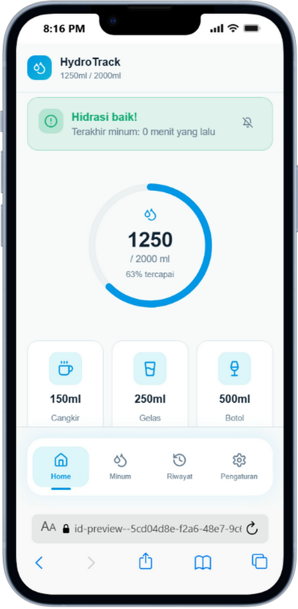

# Water Tracking Application

A beautiful and intuitive water tracking application built with React, TypeScript, Tailwind CSS, and shadcn/ui components. This application helps users monitor their daily water intake and stay hydrated.

<div align="center">
  
</div>

## Features

- **Daily Water Intake Tracking**: Log your water consumption throughout the day
- **Visual Progress Indicators**: See your hydration progress with beautiful charts and graphs
- **Reminders & Notifications**: Get timely reminders to drink water
- **Responsive Design**: Works seamlessly on desktop, tablet, and mobile devices
- **Dark/Light Mode**: Choose your preferred theme
- **Data Visualization**: Track your hydration trends over time
- **User-Friendly Interface**: Clean and intuitive UI powered by shadcn/ui

## Tech Stack

- **Framework**: React with TypeScript
- **Build Tool**: Vite
- **Styling**: Tailwind CSS with custom water-themed color palette
- **UI Components**: shadcn/ui
- **State Management**: React Query for server state, React hooks for local state
- **Routing**: React Router DOM
- **Icons**: Lucide React
- **Testing**: Vitest

## Color Palette

The application features a custom water-themed color palette:
- Water Light: `hsl(var(--water-light))`
- Water Medium: `hsl(var(--water-medium))`
- Water Deep: `hsl(var(--water-deep))`

## Setup Instructions

1. Clone the repository:
```bash
git clone <repository-url>
```

2. Navigate to the project directory:
```bash
cd water-app
```

3. Install dependencies:
```bash
npm install
```

4. Start the development server:
```bash
npm run dev
```

5. Open your browser and visit `http://localhost:8080` (or the address shown in the terminal)

## Available Scripts

- `npm run dev` - Start the development server
- `npm run build` - Build the application for production
- `npm run build:dev` - Build the application in development mode
- `npm run preview` - Preview the production build locally
- `npm run lint` - Run ESLint to check for code issues
- `npm run test` - Run unit tests once
- `npm run test:watch` - Run unit tests in watch mode

## Project Structure

```
water-app/
├── public/              # Static assets
├── src/                 # Source code
│   ├── components/      # Reusable UI components
│   ├── pages/           # Page components
│   ├── lib/             # Utility functions and libraries
│   ├── hooks/           # Custom React hooks
│   ├── types/           # TypeScript type definitions
│   ├── services/        # API and business logic
│   ├── assets/          # Images, icons, and other assets
│   ├── utils/           # Helper functions
│   ├── App.tsx          # Main application component
│   └── main.tsx         # Entry point
├── components.json      # shadcn/ui configuration
├── tailwind.config.ts   # Tailwind CSS configuration
├── vite.config.ts       # Vite configuration
└── package.json         # Project dependencies and scripts
```

## Contributing

1. Fork the repository
2. Create a feature branch (`git checkout -b feature/amazing-feature`)
3. Make your changes
4. Commit your changes (`git commit -m 'Add amazing feature'`)
5. Push to the branch (`git push origin feature/amazing-feature`)
6. Open a Pull Request

## License

This project is licensed under the MIT License - see the [LICENSE](LICENSE) file for details.

## Acknowledgments

- Built with [Vite](https://vitejs.dev/)
- UI components from [shadcn/ui](https://ui.shadcn.com/)
- Icons from [Lucide](https://lucide.dev/)
- Styling with [Tailwind CSS](https://tailwindcss.com/)